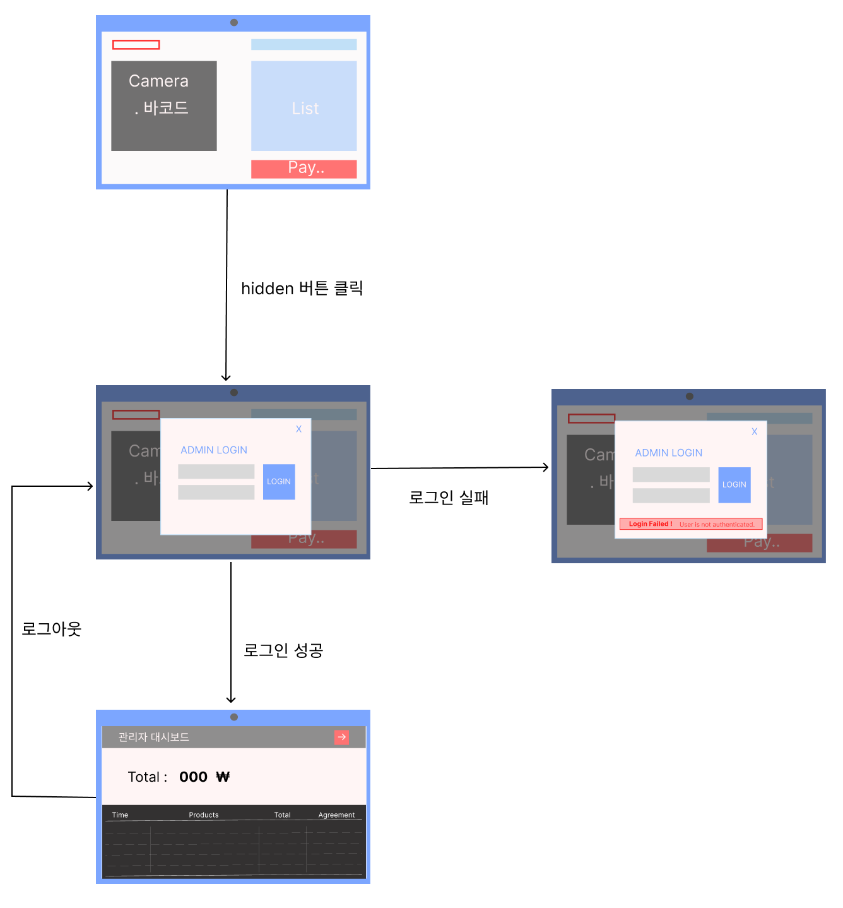
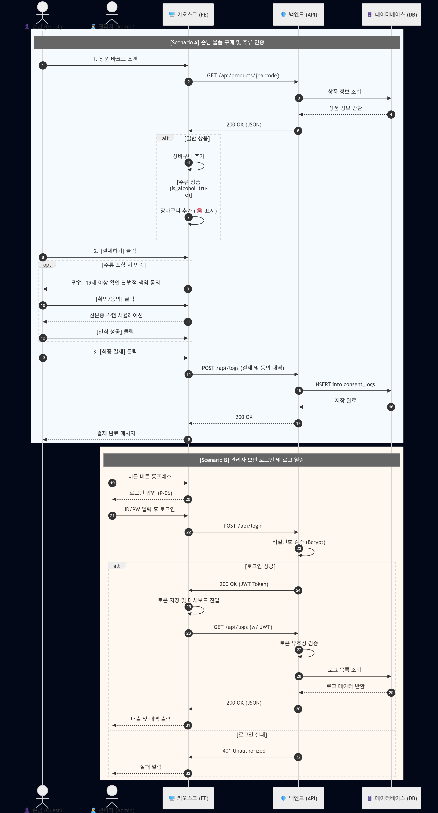

# Self-Check Kiosk v2.0
> **성인 인증 자동화를 통해 점주의 법적 리스크를 해소하고, 데이터 기반 매장 관리를 지원하는 스마트 셀프 결제 시스템입니다.**

## 📋 프로젝트 배경 및 기획 의도 (Mission)

본 프로젝트는 **주류 판매 시 직원이 겪는 심리적 부담과 법적 책임 리스크를 기술적으로 해소**하는 데 집중합니다.

* **법적 리스크 해소**: 기존 셀프 계산대는 주류 구매 시 결국 직원의 대면 확인이 필요합니다. 이는 위조 신분증 식별에 대한 부담과 미성년자 판매 시 발생하는 막대한 법적 책임을 직원이 온전히 떠안게 만듭니다. 이 과정에서 고객과의 마찰도 빈번하게 발생합니다.
* **업무 효율 극대화**: 최근 매장 관리 업무가 복잡해짐에 따라, 수시로 발생하는 '성인 인증 호출'은 직원의 업무 몰입도를 저해하는 주된 요인입니다.
* **완전 비대면 경험**: 일본의 선진 성인 인증 자동화 시스템을 벤치마킹하여, 국내 환경에 최적화된 **'직원 개입 없는 안전한 주류 결제'** 시나리오를 구현했습니다.

**v2.0**에서는 이러한 기획 의도를 바탕으로, 실제 매장에서 운영 가능하도록 **데이터베이스 기반의 매출 관리 및 보안 기능**을 추가하여 프로젝트의 완성도를 높였습니다.

---

## ✨ 주요 기능 (Features)

### 1. 🆔 성인 인증 자동화 프로세스
* **지능형 스캔 모드**: 장바구니에 주류 포함 시 즉시 성인 인증 절차 강제.
* **법적 책임 동의 UI**: 고객이 직접 법적 책임 안내를 확인하고 동의하는 프로세스 구축.
* **신분증 바코드 인증**: 신분증 뒷면 바코드를 웹캠으로 스캔하여 실시간 인증 기록 확보.

### 2. 🔐 관리자 보안 및 매출 관리 (v2.0 신규)
* **히든 트리거 로그인**: 키오스크 화면 특정 구역 5회 연속 클릭 시 로그인 모달 호출 (보안성 강화).
* **통합 매출 장부**: 
    * 주류 구매 시의 성인 인증 여부와 신분증 정보를 투명하게 기록.
    * 일반 상품을 포함한 모든 결제 내역을 DB에 저장하여 전체 매출 관리 가능.
    * **KST 시간 최적화**: 결제 시각을 한국 표준시로 자동 변환하여 관리 편의성 제공.

### 3. 🛒 유연한 장바구니 시스템
* **실시간 수량 조절**: 스캔 후 즉각적인 수량 변경 및 총액 반영.
* **전체 품목 로깅**: 구매한 모든 상품의 상세 내역(이름, 바코드, 수량)을 데이터베이스에 병합하여 기록.
  
---

## 💡서비스 사전 기획 문서
* **[PRD - 요구사항 정의서](docs/PRD_v1.0.pdf)**
* **[기능 명세서](docs/Funtional_Specification_v2.0.pdf)**

  
## 🛠 기술 스택 (Tech Stack v2.0)

### Frontend
* **HTML5 / CSS3 / JavaScript (ES6+)**: Vanilla JS를 사용하여 외부 프레임워크 의존성을 최소화하고 가벼운 성능 구현.
* **Quagga2**: 브라우저 환경에서 웹캠을 활용한 실시간 바코드 스캐닝 및 디코딩 프로세스 처리.
* **Fetch API**: 백엔드 REST API와의 비동기 통신 및 관리자 인증 토큰(Access Token) 기반 보안 요청 처리.
* **Responsive Design**: 키오스크 환경 및 관리자 대시보드 환경에 최적화된 레이아웃 구현.

### Backend
* **FastAPI**: Python 기반의 고성능 비동기(Asynchronous) 웹 프레임워크로 효율적인 API 처리.
* **Python 3.13.7**: 최신 파이썬 환경의 안정성 및 기능 활용.
* **Uvicorn**: ASGI 서버를 통한 빠른 데이터 스트리밍 및 서버 구동.
* **Pydantic v2**: 정밀한 데이터 스키마 정의 및 자동 유효성 검사로 데이터 무결성 확보.
* **Bcrypt**: 관리자 비밀번호 암호화(Hashing) 저장 및 안전한 검증 로직 구현.

### Data Storage & Security
* **SQLite3 (RDBMS)**: 기존 JSON 기반 저장 방식에서 관계형 데이터베이스로 전환하여 대량의 로그 데이터 안정성 및 쿼리 속도 개선.
* **SQLAlchemy (Core)**: 파이썬 로직 내에서 효율적인 데이터베이스 세션 관리 및 SQL 실행.
* **Token-based Auth**: `fake-jwt-token` 방식을 활용한 관리자 세션 보호 및 비인가 접근 차단.

### Architecture
* **Frontend-Backend Separation**: 프론트엔드와 백엔드를 물리적으로 분리하여 독립적인 확장성 확보.
* **RESTful API**: 리소스 중심의 API 설계로 데이터 교환의 일관성 유지.
* **Timezone Localization**: 서버의 UTC 시간을 클라이언트 브라우저 환경에 맞는 KST(한국 표준시)로 자동 변환 처리.
* **CORS Policy**: 도메인 간 리소스 공유를 위한 보안 설정 최적화.

---

## 🚀 빠른 시작

### 사전 요구사항

* Python 3.13.7 이상
* pip (Python 패키지 관리자)

### 설치 및 실행

1. **프로젝트 클론**

```bash
git clone https://github.com/ooyoo80/Self-Check-kiosk.git
cd Self-Check-kiosk
```

2. **통합 서버 실행**
v2.0은 백엔드가 프론트엔드 파일까지 동시에 서빙하도록 통합되었습니다. 터미널에서 아래 스크립트 하나만 실행하면 모든 준비가 끝납니다.

**실행 명령어**
```bash
./run-backend.sh
```
**[스크립트 내부 동작]**
- 가상 환경(.venv) 생성 및 윈도우 환경(Scripts/activate) 활성화.
- 필수 패키지(fastapi, bcrypt, uvicorn 등) 자동 설치.
- 8000번 포트로 통합 서버(API + UI) 실행.

3. **서비스 접속**
서버 구동 후 브라우저에서 아래 주소로 접근하세요.
* 🛒 키오스크 메인: http://localhost:8000/
* 🕵️ 관리자 대시보드: http://localhost:8000/admin.html/
* ⚙️ Backend API (Swagger): http://localhost:8000/docs/

> 참고: 백엔드 서버가 8000번 포트에서 화면까지 모두 관리하므로, 별도의 run-frontend.sh는 실행하지 않습니다.

---

## 📁 프로젝트 구조

```bash
Codyssey_Term_Project/
├── backend/
│   ├── main.py            # API 엔드포인트 및 비즈니스 로직
│   ├── database.py        # DB 스키마 설계 및 초기화 (v2.0)
│   └── kiosk.db           # SQLite 데이터베이스 (로그 및 상품 관리)
├── frontend/
│   ├── index.html         # 키오스크 메인 화면
│   ├── admin.html         # 관리자 전용 대시보드 (v2.0)
│   └── static/
│       ├── index.js       # 키오스크 및 성인인증 로직
│       ├── index.css      # 키오스크 레이아웃, 성인 인증 안내 및 관리자 로그인 UI 디자인
│       ├── admin.js       # 매출 데이터 시각화 및 시간 변환 로직
│       └── admin.css      # 대시보드 가독성 최적화 스타일
└── docs/                  # 설계 문서 및 다이어그램
```

---

## 📱 사용 방법 (User & Admin Guide)

### 1. 상품 스캔 및 장바구니 구성
1. **바코드 스캔**: 웹캠을 통해 상품 바코드를 스캔합니다.
2. **자동 조회**: 스캔한 상품 정보가 서버 DB에서 조회되어 실시간으로 장바구니에 추가됩니다.
3. **주류 감지**: 주류 상품이 스캔될 경우, 즉시 화면에 주류 판매 제한 안내 팝업이 표시됩니다.
4. **수량 조절**: 장바구니 내에서 각 상품의 수량을 조절하거나 불필요한 품목을 제거할 수 있습니다.

### 2. 결제 및 성인 인증 프로세스
1. **결제 시작**: 장바구니의 "결제하기" 버튼을 클릭합니다.
2. **성인 인증 (주류 포함 시)**:
   - 만 19세 이상 확인 및 법적 책임 동의 절차를 진행합니다.
   - **신분증 스캔**: 화면 안내에 따라 신분증 뒷면 바코드를 웹캠에 비춥니다.
   - 인증이 완료되면 자동으로 최종 결제 확인 단계로 넘어갑니다.
3. **일반 결제 (비주류)**: 주류가 없는 경우 별도의 인증 없이 즉시 결제 확인 단계로 진행됩니다.

### 3. 결제 완료 및 데이터 저장
1. **최종 확인**: 결제 확인 팝업에서 전체 구매 목록과 총 결제 금액을 확인합니다.
2. **DB 기록**: "결제" 버튼 클릭 시 모든 판매 내역(상품명, 금액, 동의 여부 등)이 **SQLite 데이터베이스**에 안전하게 저장됩니다.
3. **초기화**: 결제 완료 메시지와 함께 장바구니 및 인증 세션이 초기화됩니다.

### 4. 관리자 모드 (Admin Dashboard)
1. **히든 로그인**: 키오스크 메인 화면 좌측 상단 구역을 **5회 연속 클릭**하여 관리자 로그인 모달을 호출합니다.
2. **보안 접속**: 관리자 계정(`admin` / `1234`)으로 로그인하여 인증 토큰을 발급받습니다.
3. **매출 장부 조회**:
   - `admin.html` 대시보드에서 실시간으로 누적된 모든 매출 데이터를 확인합니다.
   - 각 거래 건별 **상세 품목 목록**과 **성인 인증 동의 여부**를 시각적으로 파악할 수 있습니다.
   - 모든 결제 시간은 한국 표준시(KST)로 자동 표시됩니다.

---

## 🎨 와이어프레임 및 프로토타입




## 📊 시퀀스 다이어그램



## 🗂️ ERD (Entity Relationship Diagram)


---

## 📋 API 문서 (v2.0)

### 주요 엔드포인트

#### 🛍️ 상품 및 결제 (Kiosk)
* **`GET /api/products/{barcode}`**: 바코드를 통해 상품 정보 및 주류 여부 조회
    - **Response**: `{ "status": "success", "data": { "name": "소주", "price": 2000, "isAlcohol": true } }`
* **`POST /api/logs`**: 전체 결제 내역 및 성인 인증 데이터 통합 저장
    - **Request Body**: `{ "target_barcode": "상품명(코드)[수량]...", "total_amount": 5000, "consent_agreed": true, "scanned_id_info": "950101-..." }`
    - **Response**: `{ "status": "success", "log_id": 15 }`

#### 🔑 관리자 보안 및 조회 (Admin)
* **`POST /api/admin/login`**: 관리자 계정 인증 및 세션 토큰 발급
    - **Request Body**: `{ "username": "admin", "password": "..." }`
    - **Response**: `{ "access_token": "...", "token_type": "bearer" }`
* **`GET /api/admin/logs`**: 데이터베이스에 저장된 전체 매출 장부 조회 (Header 인증 필요)
    - **Response**: `{ "status": "success", "data": [ { "id": 1, "timestamp": "...", ... } ] }`

> 자세한 대화형 API 문서는 서버 실행 후 `http://localhost:8001/docs` (Swagger UI)에서 확인할 수 있습니다.

---

## 🏗 시스템 아키텍처 (v2.0)

```text
Self-Check Kiosk v2.0 시스템 구조

📱 Frontend (Vanilla JS)
├── 📷 Scanner Module (Quagga2)
├── 🛒 Cart & Logic Manager
├── 🆔 Adult Verification Flow
└── 🔐 Admin Dashboard (KST Timezone Localization)

⚙️ Backend (FastAPI)
├── 🛣️ RESTful API Router
├── 🛡️ Security (Bcrypt Hashing / JWT Auth)
├── 🔌 Database Engine (SQLAlchemy)
└── 🌍 CORS Middleware

📦 Data Storage (SQLite3)
├── 📋 products (Master Table)
├── 📝 consent_logs (Transaction & Verification Logs)
└── 🔑 admins (Admin Credentials)
```

### 🛠️ v2.0 아키텍처 주요 변경점
* **엔드포인트 구조화**: `/api/` 프리픽스를 붙여 관리 효율성을 높였습니다.
* **보안 계층 추가**: 단순 조회가 아닌 **Bcrypt 암호화**와 **JWT 기반 인증**이 포함된 백엔드 구조를 명시했습니다.
* **데이터 엔진 변경**: `JSON` 파일에서 **SQLAlchemy 엔진 기반의 SQLite3**로 변경되어 데이터 관계(Relational) 관리가 가능해졌음을 보여줍니다.
* **로컬라이징**: 관리자 대시보드에서 처리되는 **KST(한국 표준시) 변환 로직**을 아키텍처의 특징으로 추가했습니다.
